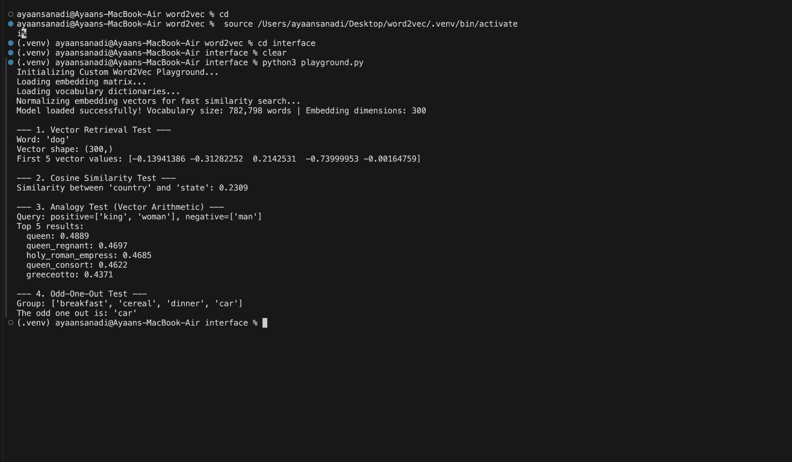

# Model Evaluation

## Why Training Loss Isn't the Benchmark

During training, the Skip-Gram with Negative Sampling (SGNS) engine continuously computes a **local training loss** that measures how well the model predicts surrounding context words for a given target word.

While this loss is useful for monitoring optimization, it is **not a reliable indicator of embedding quality**.

A model can achieve a low mathematical loss simply by memorizing highly frequent local word relationships while still producing a poor global embedding space. In other words, minimizing the objective function does not necessarily imply that semantically related words occupy meaningful positions in the learned vector space.

For this reason, Word2Vec models are traditionally evaluated using **analogy tasks**, where the quality of the learned geometric structure—not the optimization loss—is measured.

---

# Analogy Benchmark

To evaluate the learned embedding space, the model is tested against a benchmark containing **thousands of semantic and syntactic analogy questions**.

Each analogy follows the format

```
A : B :: C : D
```

where the model must infer the missing word **D** using vector arithmetic.

For example,

```
king : man :: queen : woman
```

becomes

\[
\vec{man} - \vec{king} + \vec{queen}
\]

and the nearest vector should correspond to

```
woman
```

---

# Benchmark Categories

The benchmark evaluates multiple aspects of linguistic understanding.

| Category | Example |
|-----------|---------|
| 🌍 Geography | `Athens Greece Baghdad Iraq` |
| 🏙 Cities & States | `Chicago Illinois Houston Texas` |
| 💰 Currency | `Algeria dinar Angola kwanza` |
| 👨‍👩‍👧 Family Relations | `boy girl brother sister` |
| ⚧ Gender Relations | `dad mom father mother` |
| ✍️ Adjective → Adverb | `amazing amazingly apparent apparently` |
| 🔄 Opposites | `acceptable unacceptable aware unaware` |
| 📈 Comparatives | `bad worse big bigger` |

These categories collectively measure both **semantic reasoning** and **syntactic understanding**.

---

# Evaluation Pipeline

The benchmark is evaluated using the `evaluate_benchmark()` function.

For every valid analogy in the dataset, the following steps are performed.

---

## 1. Vocabulary Validation

Before evaluation begins, every word is checked against the model's vocabulary.

If **any** of the four words is absent (typically because it was removed during frequency filtering), the analogy is skipped.

This prevents artificially lowering the reported accuracy due to out-of-vocabulary words.

---

## 2. Vector Arithmetic

The core Word2Vec analogy equation is computed.


vec{B}-vec{A}+vec{C}

For example,

```
king : man :: queen : ?
```

becomes

```text
man - king + queen
```

which produces a new point in the embedding space.

---

## 3. Cosine Similarity Search

The resulting vector is normalized and compared against every normalized embedding in the vocabulary using cosine similarity.

The nearest neighbor is selected as the model's prediction.

---

## 4. Accuracy Calculation

If the predicted word exactly matches the expected answer from the benchmark dataset, the prediction is counted as **correct**.

Final benchmark accuracy is computed as

```
Correct Predictions
------------------------------
Total Valid Benchmark Questions
```

---

# Training Configuration

The reported results were obtained using the following hyperparameters.

| Hyperparameter | Value |
|----------------|------:|
| Embedding Dimension | **300** |
| Epochs | **25** |
| Initial Learning Rate | **0.025** |
| Context Window | **5** |
| Negative Samples (k) | **5** |

---

# Results

## Training Time

```
17,809.67 seconds
≈ 4.95 hours
```

---

## Analogy Benchmark Accuracy

```
35.63% on the enwik9 dataset
```

Although the objective function converged throughout training, this analogy benchmark provides a much more meaningful measure of embedding quality.

The achieved accuracy demonstrates that the model successfully captures a substantial amount of semantic and syntactic structure despite being implemented entirely from scratch.

---

# Why This Evaluation Matters

Unlike conventional classification models, Word2Vec has **no explicit labels** during training.

The objective is simply to predict neighboring words.

As a result, evaluating the optimization loss alone provides very little insight into the usefulness of the learned embeddings.

Analogy benchmarks directly measure whether the model has learned meaningful relationships such as

```
Paris     → France
Rome      → Italy

King      → Queen
Man       → Woman

Run       → Running
Good      → Better
```

A high analogy accuracy therefore indicates that the embedding space has learned rich semantic and syntactic structure rather than merely memorizing local context statistics.

---

## Playground Demonstration


